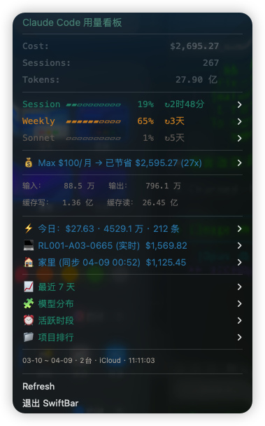
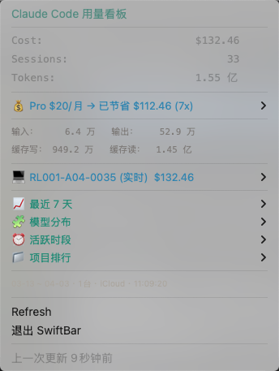

# cc-token-status

**Claude Code usage dashboard in your macOS menu bar.**

One click to see costs, tokens, plan limits, trends, and multi-machine sync — all in SwiftBar nested menus. No app to install, no server to run, just a single Python script.

<p align="center">
  
  &nbsp;&nbsp;
  
</p>

## Features

| Feature | Description |
|---------|-------------|
| **Cost & Token Overview** | API-equivalent cost, session count, total tokens — always visible |
| **Plan Usage Limits** | Official 5h session & 7d weekly quotas with live progress bars |
| **Subscription ROI** | How much your Pro/Max/Team plan saves vs API pricing |
| **Today at a Glance** | Today's spending, tokens, and message count |
| **7-Day Trend** | Daily cost bar chart with drill-down details |
| **Model Breakdown** | Per-model usage (Opus / Sonnet / Haiku) with percentages |
| **Hourly Heatmap** | When are you most active? Morning, afternoon, evening, night |
| **Project Ranking** | Which projects consume the most tokens |
| **Multi-Machine Sync** | iCloud Drive auto-sync across Macs — zero config |
| **Bilingual** | Auto-detects system language (English / Chinese) |

## Quick Install

```bash
curl -fsSL https://raw.githubusercontent.com/echowonderfulworld/cc-token-status/main/install.sh | bash
```

The installer will:
1. Check for Claude Code
2. Install [SwiftBar](https://github.com/swiftbar/SwiftBar) if needed (via Homebrew)
3. Download the plugin
4. Ask your subscription tier (for ROI calculation)
5. Enable iCloud sync if available

## Plan Usage Limits

cc-token-status reads your Claude Code OAuth token from the macOS Keychain and queries the official Anthropic API to show real-time plan usage:

```
Session ▰▰▱▱▱▱▱▱▱▱  14%  ↻3h42m
Weekly  ▰▰▰▰▰▰▱▱▱▱  64%  ↻4d
Sonnet  ▱▱▱▱▱▱▱▱▱▱   1%  ↻5d
```

- Color-coded: 🟢 <50% · 🟡 50–80% · 🔴 >80%
- Cached locally (4 min TTL) to respect API rate limits

## Pricing

cc-token-status calculates API-equivalent costs using official Anthropic pricing:

| Model | Input | Output | Cache Write | Cache Read |
|-------|-------|--------|-------------|------------|
| Opus 4.5 / 4.6 | $5 | $25 | $10 | $0.50 |
| Sonnet 4.5 / 4.6 | $3 | $15 | $3.75 | $0.30 |
| Haiku 4.5 | $1 | $5 | $1.25 | $0.10 |

*Prices in USD per 1M tokens.*

## Configuration

Edit `~/.config/cc-token-stats/config.json`:

```json
{
  "subscription": 100,
  "subscription_label": "Max",
  "language": "auto",
  "sync_mode": "auto",
  "machine_labels": {
    "my-hostname": "Office Mac"
  }
}
```

| Key | Description | Default |
|-----|-------------|---------|
| `subscription` | Monthly plan cost in USD (0 to hide ROI) | `0` |
| `subscription_label` | Plan name: `"Pro"`, `"Max"`, `"Team"` | `""` |
| `language` | `"auto"`, `"en"`, or `"zh"` | `"auto"` |
| `sync_mode` | `"auto"` (iCloud), `"custom"`, or `"off"` | `"auto"` |
| `machine_labels` | Friendly names for hostnames | auto-detect |
| `menu_bar_icon` | SwiftBar SF Symbol | `sfSymbol=sparkles.rectangle.stack` |

## Multi-Machine Sync

If you use Claude Code on multiple Macs with iCloud Drive, cc-token-status automatically syncs usage data across machines — no setup required.

Each machine writes its stats to iCloud. The plugin reads all machines and shows a combined view with per-machine breakdown.

## Requirements

- macOS
- [Claude Code](https://claude.ai/download)
- Python 3.8+
- [SwiftBar](https://github.com/swiftbar/SwiftBar) (auto-installed)

## Uninstall

```bash
rm ~/Library/Application\ Support/SwiftBar/plugins/cc-token-stats.5m.py
rm -rf ~/.config/cc-token-stats
```

## License

MIT
